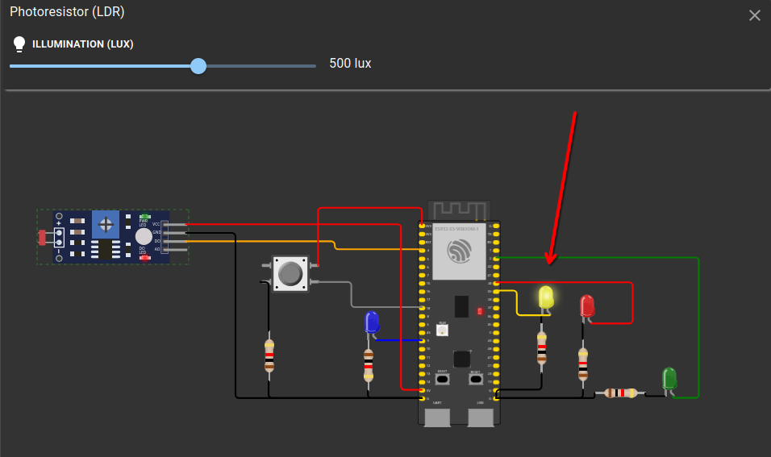
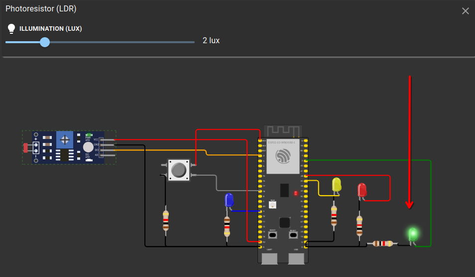
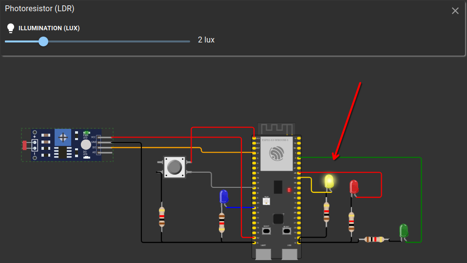
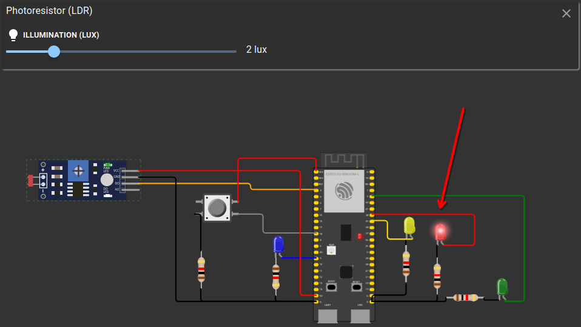

# Modo noturno acionado:

Led LDR com pouca luminosidade e led amarelo aceso

# Semáforo Funionando:

Led LDR com muita luminosidade

## Led verde:
Led Verde aceso

## Led amarelo:
Led Amarelo aceso

## Led vermelho:
Led Vermelho aceso

# Projeto
[Link do projeto](https://wokwi.com/projects/417161673392421889)